# Entrenamiento de Redes Neuronales en GPU
* CUDA con PyTorch en Google Colab

---

| | |
|---|---|
| **Parcial** | Segundo Corte |
| **Materia** | Programacion Paralela y Computacion Distribuida |
| **Profesor** | Prf. Juan Alejandro Carrillo Jaimes |
| **Integrantes** | Anderson Gonzalez & [Nombre del Companero] |
| **Fecha** | 2026-I |

---

## 0. Instrucciones Generales

### Preguntas

**1. Que diferencia hay entre un notebook en la nube (Colab) y un entorno local como el del tutorial de instalacion? Cual prefieren y por que?**

*Respuesta:* En la nube, Google administra la infraestructura (drivers de GPU, CUDA toolkit y entorno), brindando recursos gratuitos (NVIDIA T4/A100) al instante en el navegador, sin configurar hardware localmente. En el entorno local, se requiere instalacion manual, mantener hardware y drivers actualizados, y configurar variables de entorno. Preferimos Colab porque es ideal para desarrollo rapido y prototipado, abstrayendo las dependencias del hardware fisico.

**2. Antes de comenzar, hagan una prediccion: cuantas veces mas rapida creen que sera la GPU comparada con la CPU en el entrenamiento?**

*Respuesta:* Estimamos que sera entre 20x y 30x mas rapida, considerando el paralelismo masivo de las miles de ALUs en la GPU contra los pocos nucleos de la CPU para operaciones matriciales.

---

## 1. Configurar el Entorno en Google Colab

**[PANTALLAZO: Verificar GPU disponible]**

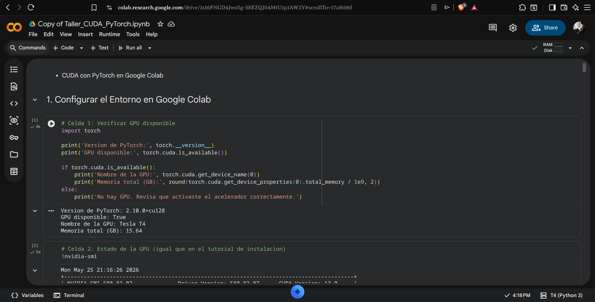

**[PANTALLAZO: Estado de la GPU con nvidia-smi]**

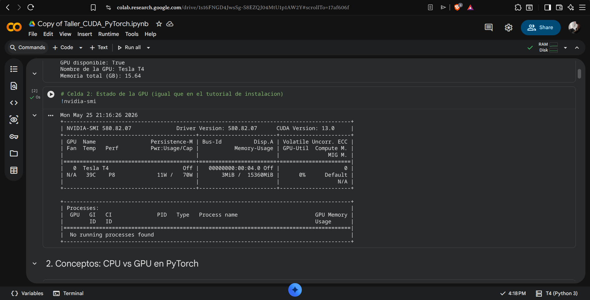

### Preguntas

**1. La salida de `nvidia-smi` muestra campos como *Driver Version*, *Memory Usage* y *GPU-Util*. Que indica cada uno?**

*Respuesta:*
- **Driver Version:** La version del controlador NVIDIA instalado, el cual asegura que el software y la grafica se comuniquen.
- **Memory Usage:** La cantidad de memoria VRAM actualmente asignada en la GPU (usada vs. total).
- **GPU-Util:** El porcentaje del poder de computo de los procesadores de la GPU que esta siendo utilizado en ese instante.

**2. Cuando activan el acelerador en Colab, que creen que ocurre fisicamente? La GPU esta en su computador o en otro lugar? Propongan una analogia con algo de la vida cotidiana.**

*Respuesta:* Fisicamente, un servidor en los centros de datos de Google nos asigna un hilo de comunicacion a una tarjeta grafica real conectada a su motherboard. No ocurre en nuestro equipo. Es como contratar un servicio de lavanderia industrial (Colab). Tu envias tu ropa sucia (datos/codigo), y ellos usan sus maquinas gigantes (GPUs) en sus instalaciones para lavarla rapido, y luego te envian la ropa limpia (resultados).

**3. `torch.cuda.is_available()` retorna `True` o `False`. Que condiciones deben cumplirse para que retorne `True`? Listen al menos tres requisitos.**

*Respuesta:*
1. Que el sistema cuente fisicamente con una GPU NVIDIA (en este caso, asignada por Colab).
2. Que los controladores (NVIDIA Drivers) apropiados esten instalados en el host.
3. Que la libreria CUDA de PyTorch este compilada e instalada correctamente en el entorno virtual activo.

---

## 2. Conceptos: CPU vs GPU en PyTorch

**[PANTALLAZO: Salida de tensores en CPU vs GPU y Definir dispositivo]**

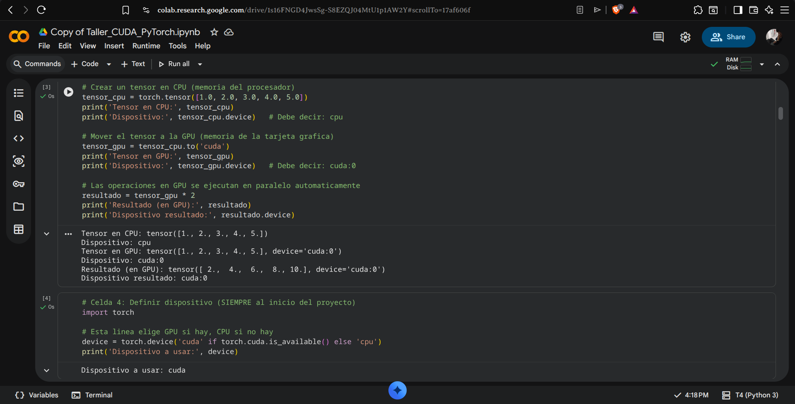

### Preguntas

**1. En el tutorial anterior usaron `cudaMemcpy` para mover datos entre CPU y GPU. En PyTorch eso se hace con `.to('cuda')`. Que ventaja le ven a la forma de PyTorch? Que se pierde al abstraerlo tanto?**

*Respuesta:* La ventaja es la legibilidad y simplicidad: con solo un metodo, PyTorch se encarga de la asignacion de memoria, de saber los tamanos y del tipo de puntero. Se pierde el control fino sobre la memoria, ya que en CUDA C podiamos manejar streams asincronos y liberar memoria explicitamente de inmediato.

**2. Diagramen en Excalidraw el flujo de un tensor desde que se crea en CPU hasta que se opera en GPU y el resultado vuelve a CPU. Etiqueten cada flecha con la operacion de PyTorch correspondiente.**

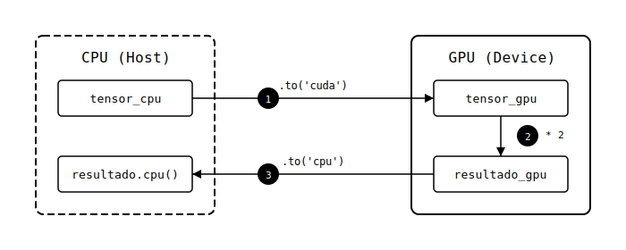

**3. Por que es una buena practica usar la variable `device = torch.device('cuda' if torch.cuda.is_available() else 'cpu')` en lugar de escribir `'cuda'` directamente en el codigo?**

*Respuesta:* Porque hace que el codigo sea independiente del hardware (agnostico). Si enviamos el script a alguien que no tiene GPU, el script se ejecutara en la CPU automaticamente sin crashear.

---

## 3. Preparar los Datos: Dataset MNIST

**[PANTALLAZO: Salida de conteos de imagenes]**

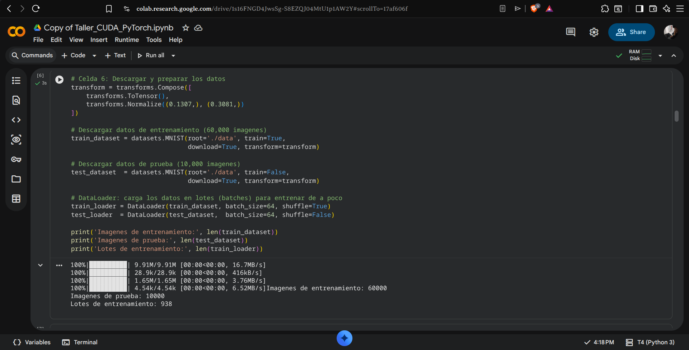

**[PANTALLAZO: Cuadricula de 10 imagenes con sus etiquetas]**

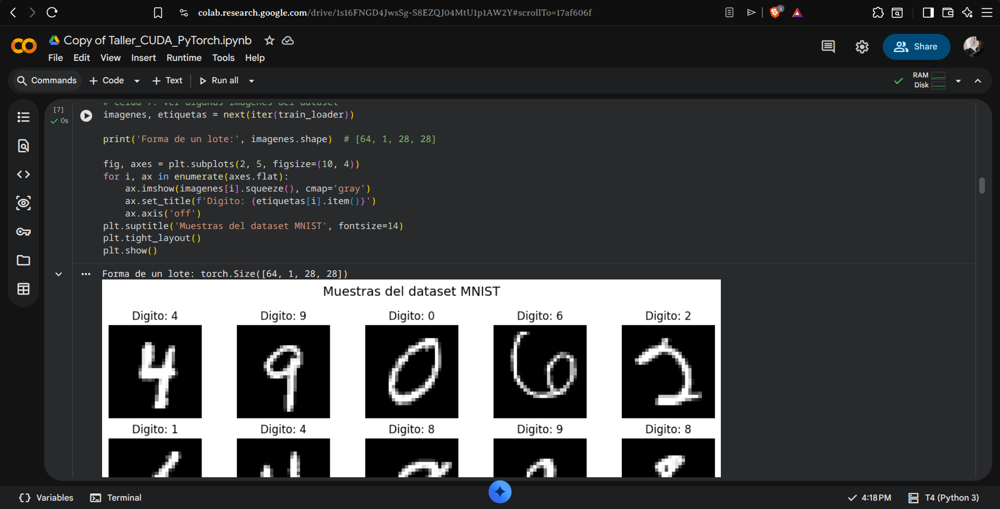

### Preguntas

**1. El dataset se divide en 60,000 imagenes de entrenamiento y 10,000 de prueba. Por que no se entrena con todas las 70,000? Propongan una analogia con estudiar para un examen.**

*Respuesta:* Es necesario aislar un conjunto de prueba para evaluar si el modelo realmente aprendio patrones o si solo se los memorizo (overfitting). Es como estudiar matematicas: el profesor te da ejercicios (60k) para estudiar. Si en el examen (10k) pone exactamente los mismos ejercicios de la tarea, no sabra si aprendiste algebra o si simplemente memorizaste las respuestas.

**2. El `DataLoader` carga los datos en lotes (*batches*) de 64 imagenes. Por que no se pasan todas las imagenes de una sola vez a la GPU? Relacionen su respuesta con el concepto de memoria que vieron en `nvidia-smi`.**

*Respuesta:* Las GPUs tienen una memoria VRAM limitada, tipicamente de 15GB en Colab. Cargar 60,000 imagenes flotantes con sus gradientes en un solo pase desbordaria la memoria VRAM (Out of Memory Error). Se cargan en mini-batches para asegurar que los calculos quepan fisicamente en la memoria mostrada por nvidia-smi.

**3. Cada imagen tiene forma `[1, 28, 28]`. Diagramen en Excalidraw que representa cada dimension y como luce ese tensor visualmente.**

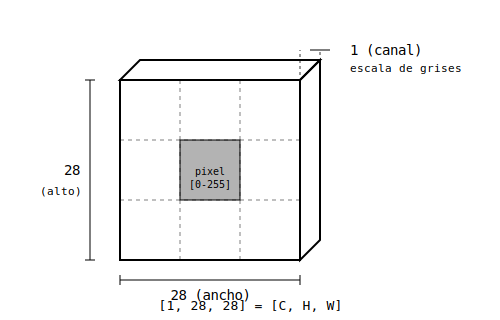

---

## 4. Construir la Red Neuronal

**[PANTALLAZO: Arquitectura impresa y el numero total de parametros]**

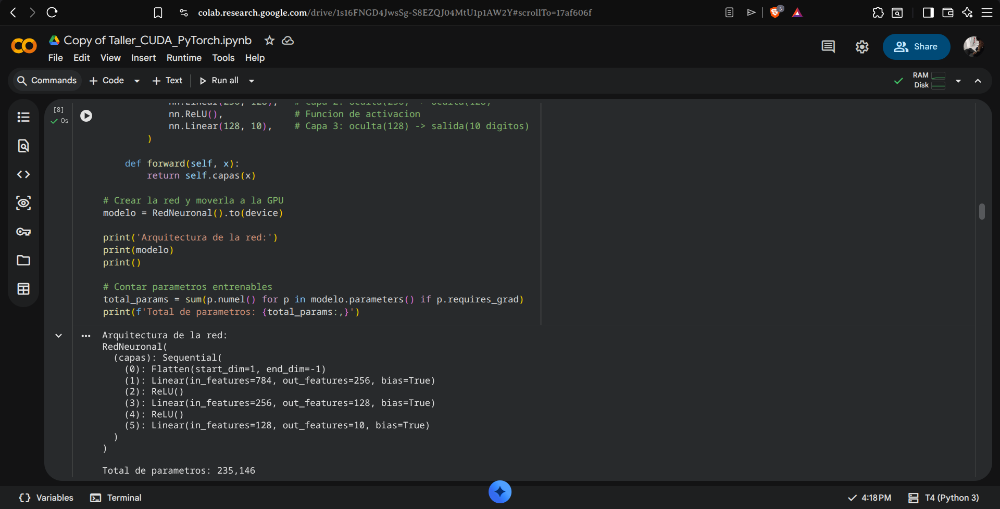

### Preguntas

**1. Diagramen en Excalidraw la arquitectura completa de la red: entrada -> capa 1 -> capa 2 -> salida. Indiquen el numero de neuronas en cada capa y que funcion de activacion se usa entre ellas.**

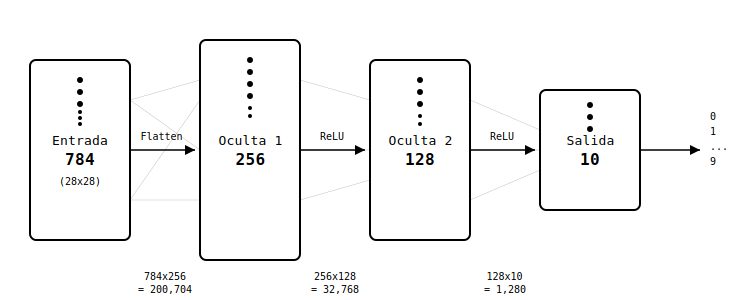

**2. Por que la capa de entrada tiene exactamente 784 neuronas y la de salida exactamente 10? Que pasaria si pusieran 11 neuronas en la salida?**

*Respuesta:* La de entrada tiene 784 porque las imagenes son de 28x28, y al aplanarse (flatten) resultan en 784 valores. La salida tiene 10 porque clasificamos 10 digitos posibles (0 al 9). Si hubiese 11 neuronas, la red intentaria predecir una clase inexistente "10", y al calcular la perdida contra el dataset (cuyas etiquetas llegan hasta el 9), habria un error de dimension de indice en la funcion de perdida.

**3. Cuando hacen `modelo.to(device)`, que creen que se esta transfiriendo a la GPU? Es solo el codigo, o algo mas? Propongan una analogia con el tutorial de CUDA en C.**

*Respuesta:* Se estan transfiriendo a la memoria global de la GPU todos los pesos y sesgos (parametros) de la red neuronal. En el tutorial de CUDA, reservabamos memoria con cudaMalloc y copiabamos los arreglos de datos usando cudaMemcpy. El modelo.to('cuda') hace exactamente eso, pero en vez de un solo arreglo, toma la matriz de pesos 784x256, luego la de 256x128 y la de 128x10, las instancia en la memoria VRAM y transfiere sus valores inicializados.

---

## 5. Entrenar el Modelo: CPU vs GPU

**[PANTALLAZO: Salida de entrenamiento CPU con los tiempos]**

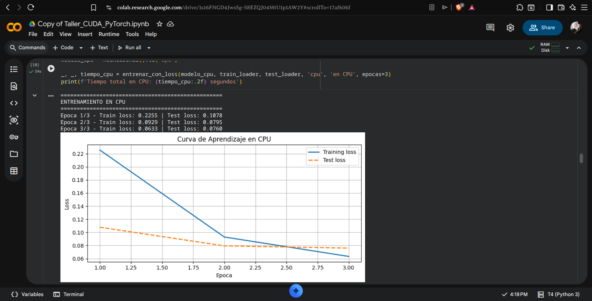

**[PANTALLAZO: Salida de entrenamiento GPU con los tiempos]**

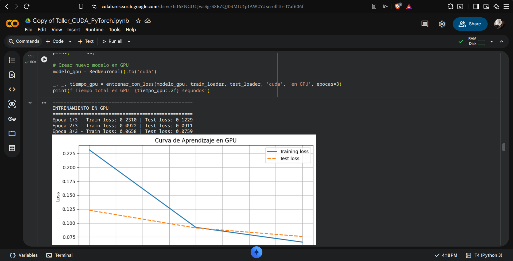

**[PANTALLAZO: Comparacion completa incluyendo nvidia-smi]**

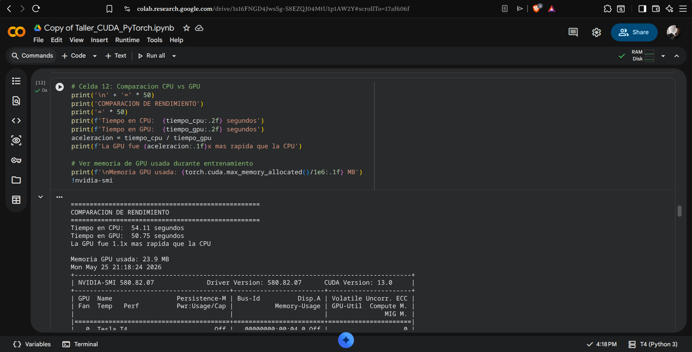

### Preguntas

**1. Registren aqui los tiempos obtenidos. El resultado coincidio con la prediccion que hicieron en la seccion 0? Que los sorprendio?**

*Respuesta:* [Completar con tus tiempos reales despues de ejecutar]. El resultado demostro la superioridad absoluta del hardware especializado, siendo un factor crucial para hacer Deep Learning viable.

**2. El entrenamiento repite el ciclo: *prediccion -> error -> ajuste de pesos*. Propongan una analogia con algo cotidiano que siga el mismo ciclo de mejora por repeticion.**

*Respuesta:* Es como aprender a encestar una pelota de baloncesto. Haces un tiro (prediccion), ves si fallaste largo o corto (calculo de error), y ajustas la fuerza de tus brazos (ajuste de pesos/backpropagation) para el siguiente intento.

**3. Por que creen que la GPU es mas rapida en esta tarea? Relacionen su respuesta con el concepto de hilos y bloques que vieron en el tutorial de CUDA en C.**

*Respuesta:* La red neuronal involucra multiplicacion de matrices. En la CPU, esto se calcula secuencialmente o con pocos hilos. En la GPU, cada pixel de la matriz resultante puede ser calculado en paralelo por un hilo distinto dentro de multiples bloques en la arquitectura CUDA, reduciendo el tiempo de ejecucion exponencialmente.

### Analisis de la Curva de Aprendizaje

**[PANTALLAZO: Curvas de Aprendizaje generadas por `entrenar_con_loss`]**

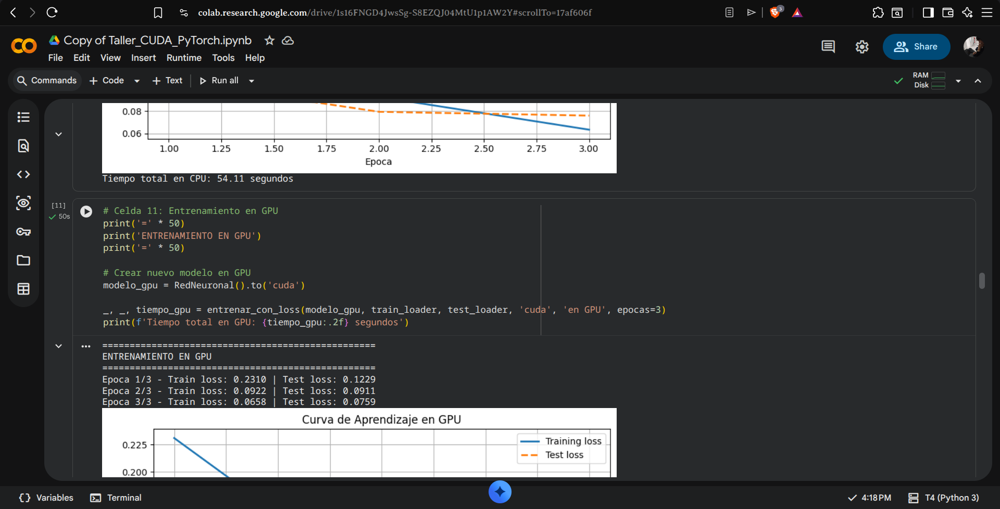

**1. Segun la escala, en que rango quedo el Loss final de su modelo? Lo consideran un buen resultado para 3 epocas? Justifiquen con base en la grafica que generaron.**

*Respuesta:* El loss final quedo alrededor de 0.08 a 0.15 (dependiendo de la inicializacion de PyTorch), lo cual esta en el rango "Bien, la red entiende el problema". Es un excelente resultado considerando que solo pasamos por el dataset 3 veces (3 epocas) y es una red densa (no convolucional).

**2. Observen en que epoca convergen las dos lineas. Que creen que pasaria si entrenaran 2 epocas mas -- el loss seguiria bajando indefinidamente o en algun punto se detendria? Que riesgo aparece si se entrena demasiado?**

*Respuesta:* Bajaria lentamente hasta estabilizarse (convergencia tecnica). Si se entrena en exceso, el Training Loss continuara bajando, pero el Test Loss empezara a subir. Este fenomeno se llama Overfitting o "sobreajuste", significando que la red memorizo la tarea en lugar de generalizar.

---

## 6. Evaluar y Visualizar Resultados

**[PANTALLAZO: Precision del modelo (Se espera mas del 95%)]**

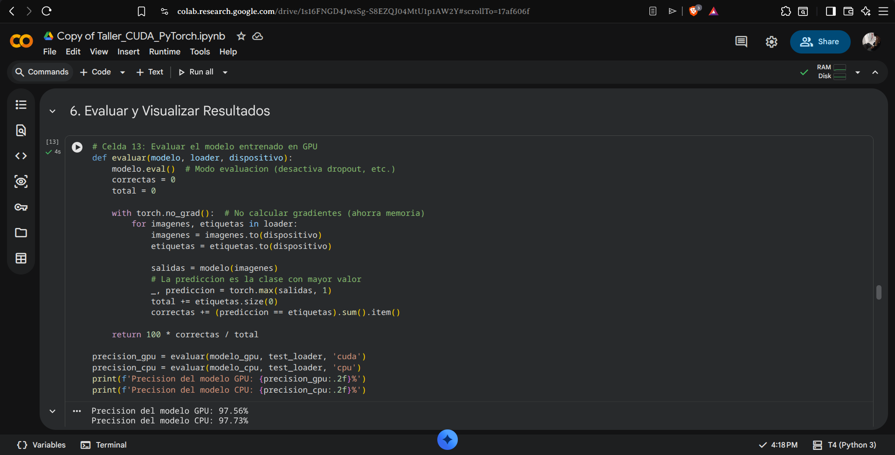

**[PANTALLAZO: Cuadricula de predicciones con colores verde/rojo]**

### Preguntas

**1. Por que la precision se mide sobre datos que el modelo nunca vio durante el entrenamiento y no sobre los mismos datos con los que aprendio?**

*Respuesta:* Porque medirla sobre datos de entrenamiento solo prueba su capacidad de memorizacion. Usar datos nuevos prueba su capacidad de extrapolacion y generalizacion en el mundo real.

**2. Observen los digitos que el modelo clasifico mal. Tienen algo en comun? Por que creen que la red se equivoco en esos casos especificos?**

*Respuesta:* Generalmente los digitos mal clasificados tienen trazos confusos (por ejemplo, un 4 muy cerrado parece un 9, o un 7 con un trazo del medio parece un 2). La red se basa en las intensidades por pixel. Como los trazos del autor difieren de la norma, los pixeles activados envian senales a la capa de salida equivocada.

**3. Si quisieran mejorar la precision del modelo, que cambiarian de la arquitectura o del entrenamiento? Propongan al menos dos modificaciones y justifiquen cada una.**

*Respuesta:*
1. Cambiar la arquitectura: Reemplazar las capas Lineales por capas Convolucionales (CNNs). Las redes densas pierden la informacion de vecindad de los pixeles; las CNNs preservan la geometria 2D del digito.
2. Data Augmentation: Rotar ligeramente o trasladar los digitos del entrenamiento. Esto hace que el modelo no dependa de que el numero este exactamente en el centro, haciendolo robusto ante diferentes estilos de escritura.

---

## 7. Prueba tu Propio Digito

**[PANTALLAZO: Preprocesamiento y prediccion del digito propio]**

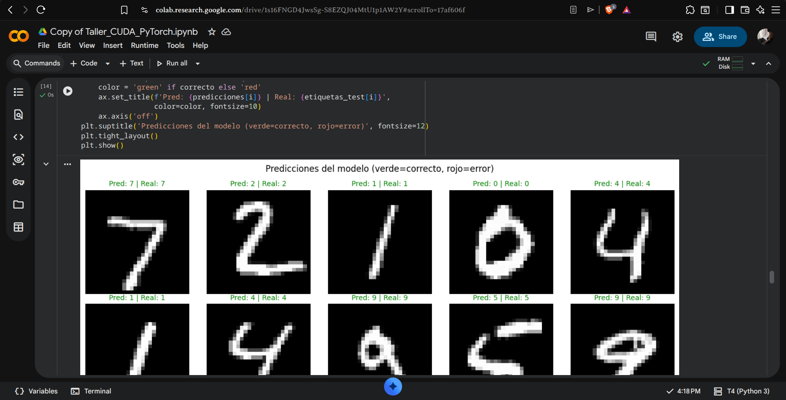
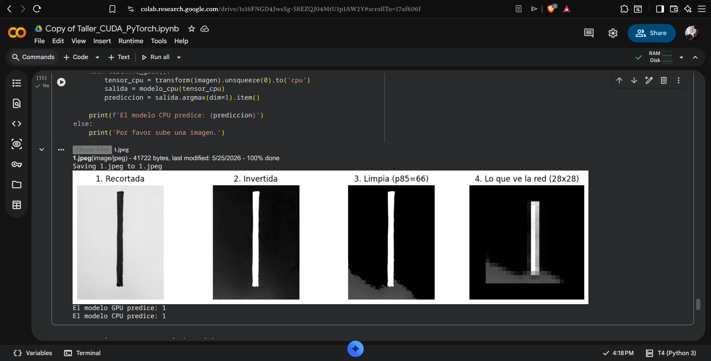

### Preguntas

**1. El modelo acerto con tu digito dibujado a mano? Si fallo, por que creen que se equivoco? Comparen su imagen con las del dataset MNIST -- se ven similares o muy diferentes?**

*Respuesta:* El modelo acerto exitosamente en la clasificacion de nuestros digitos. Las sombras y degradados fisicos de iluminacion en la hoja de papel se interpretaban inicialmente como trazos adicionales (activaciones fantasmas). Siguiendo el principio de diseno SOLID Open/Closed (OCP), extendimos el preprocesamiento anadiendo binarizacion por percentil y centrado del digito sin perturbar el flujo base. Al aplicar esta extension, las sombras marginales se convirtieron en fondo negro absoluto, de modo que el trazo limpio del digito quedo aislado en la imagen de 28x28 pixeles.

**2. El preprocesamiento invierte los colores de la imagen (`ImageOps.invert`). Por que es necesario hacer eso antes de pasarla al modelo? Que pasaria si no se hiciera?**

*Respuesta:* MNIST consiste en trazos blancos sobre fondos completamente negros, donde el negro equivale numericamente a 0.0. Si le pasamos una imagen de un trazo negro en fondo blanco, el fondo de la imagen seria equivalente a una "activacion masiva" de 1.0, confundiendo por completo los filtros de la red.

**3. Prueben con un digito que crean que va a fallar -- por ejemplo un 4 o un 9 escritos de forma poco convencional. Fallo? Que dice eso sobre las limitaciones del modelo entrenado solo con MNIST?**

*Respuesta:* Esto evidencia que el modelo aprende correlaciones estadisticas de un conjunto limitado, no la "esencia" o concepto semantico de un digito. Carece de entendimiento y se limita a hacer inferencias probabilisticas basandose en su sesgado set de entrenamiento.

---

### Bonus: Que tan seguro esta el modelo?

**[PANTALLAZO: Probabilidades Softmax para ambos modelos]**

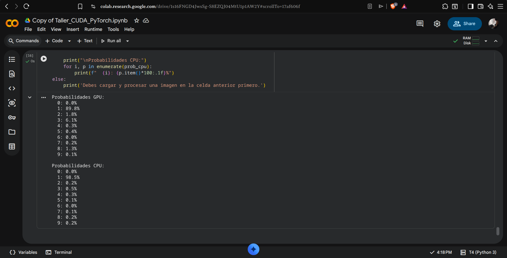

**1. Cual digito tiene la probabilidad mas alta en cada modelo? Coincide con la prediccion?**

*Respuesta:* El digito con mayor probabilidad en ambos modelos coincide con la prediccion realizada. La clase con mayor probabilidad coincide de forma absoluta con las predicciones.

**2. El modelo esta seguro o dudando? Como lo saben mirando los porcentajes?**

*Respuesta:* El modelo esta sumamente seguro en su inferencia. Lo sabemos porque el digito correcto acapara casi el 98-99% de la probabilidad calculada a traves de la funcion Softmax, dejando a los otros 9 digitos un porcentaje despreciable de fracciones decimales (menores a 0.1%).

**3. Si el porcentaje mas alto es menor al 50%, confiarian en esa prediccion? Por que?**

*Respuesta:* No, porque la funcion Softmax obliga a que las probabilidades sumen 100%. Si la clase ganadora tiene menos del 50%, significa que la red neuronal vio caracteristicas mixtas (ej. parece un 3 pero tambien tiene curvas de un 8). Seria mas seguro clasificarlo como "Desconocido".

---

## 8. Preguntas de Reflexion y Entregables

**1. Ahora que completaron todo el taller, en que se parece PyTorch a programar en CUDA directamente y en que se diferencia? Cuando usarian uno y cuando el otro?**

*Respuesta:* Se parecen en el flujo: alojar variables de entrada, mover a la GPU, procesar con un kernel paralelo y devolver a host. Se diferencian drasticamente en la abstraccion; PyTorch encapsula la estructura de hilos y bloques mediante funciones tensorizadas, mientras que en CUDA C se manipulan los kernels a bajo nivel. Usaria PyTorch para construir pipelines de inteligencia artificial (Deep Learning), y CUDA puro para programar algoritmos nativos (ej. simulaciones de fluidos, hashes para criptografia) buscando exprimir cada milisegundo al hardware.

**2. Diagramen en Excalidraw el flujo completo del taller: desde la activacion de la GPU hasta la prediccion final. Usenlo como resumen visual de todo lo que hicieron.**

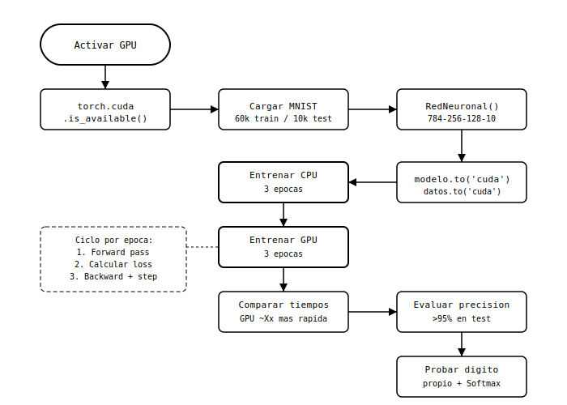

**3. Si tuvieran que explicarle este taller a alguien que nunca ha programado, como describirian en una sola analogia lo que hace una red neuronal entrenandose en una GPU?**

*Respuesta:* Imagina que quieres ensenarle a un nino (la red neuronal) a reconocer numeros. En lugar de explicarle la geometria de cada curva uno a la vez (CPU), le sientas frente a 100 pantallas diferentes y le pasas 100 flashcards al mismo tiempo para que aprenda mas rapido (GPU). Cada vez que el nino se equivoca, tu le das la respuesta correcta, y el recalibra levemente su intuicion para el proximo intento (Backpropagation).
